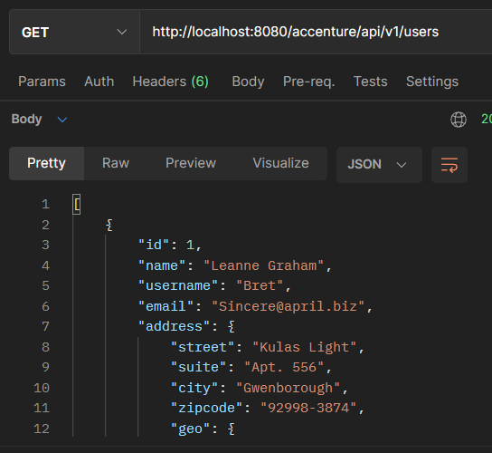
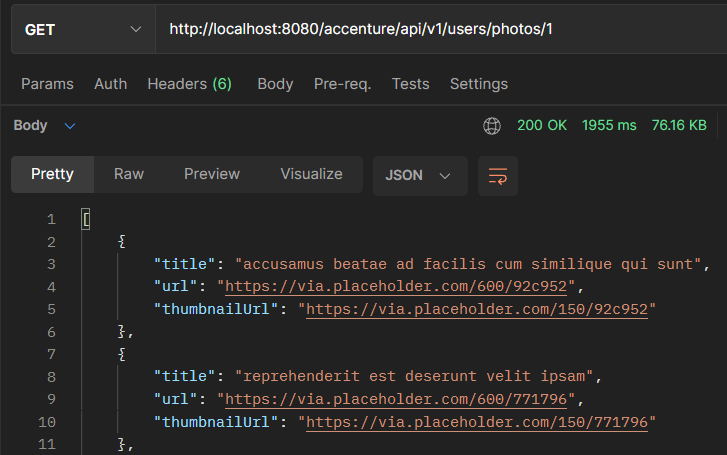
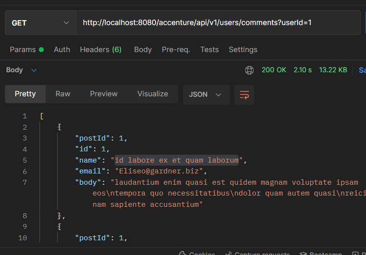

#Prueba tecnica Accenture

###Esta Api, se encuentra documentada con Swagger 

###Url: http://localhost:8080/accenture/swagger-ui.html#/
###Url Aws: http://34.228.196.162/accenture/api/v1/users

#Endpoint realizados

1. ## Obtener a todos los usuarios
    
    ###http://localhost:8080/accenture/api/v1/users

    ###**Con este endpoint podermos obtener todos los usuarios que se encuentran en la API externa**

    ###Photo ejemplo: 
    

2. ### Obtener las fotos de un usuario

   ###http://localhost:8080/accenture/api/v1/users/photos/ **idusuario**

    ###**Con este endpoint podemos obtener todas las fotos de un usuario**

    ##Photo ejemplo
   
    

3. ### Obtener los comentarios por idUsuario o por Name del comentario

    ###http://localhost:8080/accenture/api/v1/user/commentsname= **id labore ex et quam laborum**
    ###http://localhost:8080/accenture/api/v1/users/comments?userId= *1*

    ###**Con este endpoint podemos obtener todos los comentarios de un usuario en especifico, o por el nombre del comentario**
    
    ##Phtoo ejemplo
    
    
   
